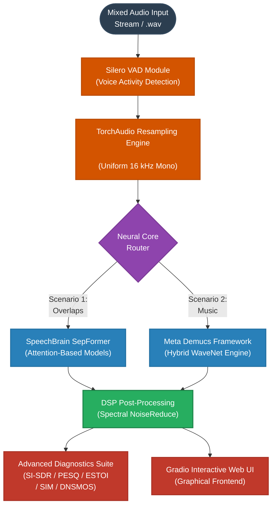

# Intelligent Overlapped Speech Separation & Audio Enhancement Platform

<p align="center">
  
</p>

<p align="center">
  <a href="https://python.org"></a>
  <a href="https://pytorch.org"></a>
  <a href="https://gradio.app"></a>
  <a href="https://speechbrain.github.io"></a>
</p>

## 📌 Introduction & Core Objective
This repository contains a high-performance audio signal processing application designed to solve the classic acoustic **"Cocktail Party Problem"**—the digital isolation of individual speaker signals from single-channel overlapped audio mixtures (Blind Source Separation - BSS).

The platform bridges the gap between classical Digital Signal Processing (DSP) techniques and modern Deep Learning frameworks. It ingests complex acoustic streams, performs real-time vocal boundary scanning, maps multi-speaker overlaps, eliminates stationary environmental noise, and calculates objective evaluation metrics along with non-intrusive neural quality predictions.

---

## 🏗️ System Architecture & Workflow Diagram

<details open>
<summary><b>🔍 Click to collapse/expand the Interactive System Architecture Diagram</b></summary>


</details>

### Modular Pipeline Execution:
* **Voice Activity Detection (VAD):** Employs Silero VAD via PyTorch Hub to scan incoming vectors, discard silence windows, and stitch together active speech frames to reduce redundant computational overhead.
* **Standardized Resampling:** Automatically normalizes variable sample rates to a stable 16 kHz mono domain using TorchAudio mathematical interpolation.
* **Deep Learning Core Extraction:** Dynamically streams audio frames into specific neural structures depending on the evaluation scenario (Attention-based dual-path transformers or asymmetric convolutional models).
* **DSP Spectral Attenuation:** Utilizes stationary non-linear spectral subtraction (NoiseReduce) to eliminate environmental noise floors without inducing artificial musical artifacts.
* **Quality Diagnostics Suite:** Implements full-reference mathematical metrics and neural network models to gauge clarity, intelligibility, and subjective human preference scores.

---

## 🌟 Key Application Features
* **Multi-Speaker Separation:** Processes complex overlaps for exactly 2-speaker or 3-speaker mixtures using attention-gated dual-path networks.
* **Vocal & Instrumental Stem Dissection:** Integrates multi-shift sub-band separation optimized to untangle singing voices from backing accompaniment tracks.
* **Full-Reference Quality Benchmarking:** Auto-calculates mathematical performance criteria including **SI-SDR** (Signal-to-Distortion Ratio), **PESQ** (Perceptual Evaluation of Speech Quality), and **ESTOI** (Extended Short-Time Objective Intelligibility).
* **Speaker Identity Verification (SIM):** Extracts speaker embeddings using an independent neural voice encoder to compute cosine similarity values, confirming timbre retention.
* **Microsoft DNSMOS Core Integration:** Employs non-intrusive neural assessment engines mapping the ITU-T Rec. P.808 standard to predict human subjective mean opinion scores for Background Noise (SIG), Speaker Distortion (BAK), and Overall Quality (OVRL).
* **Premium Web UI Experience:** Built with a customized Gradio Dark Theme incorporating base64 startup panel fade transitions, localized CSS configurations, and integrated multi-channel `.zip` production results archiving.

---

## 📊 Rigorous Validation & Stress Scenarios
The platform was subjected to advanced simulation environments to stress operational boundaries and satisfy technical validation requirements:

### 📁 Scenario 1: Target Voice Obscured by Stationary Noise
* **Context:** Evaluation of speech isolation capabilities under heavy stationary environmental degradation (e.g., thermal noise, continuous urban hum, or white noise floors).
* **Execution:** System cascades non-linear spectral filtering prior to deep attention processing, effectively recovering the target speaker's phase matrix.

### 📁 Scenario 2: Target Voice Mixed with Studio Music Tracks
* **Context:** Emulates production cross-talk, broadcast background leakage, or acoustic entertainment interference.
* **Execution:** Uses a specialized hybrid Demucs model configured with an 80% overlapping window allocation and 5 distinct internal shifts to isolate pure speaker frequencies from complex arrangements.

---

## 📽️ Visual Previews & Demonstration Clips

### Web Dashboard Layout
*(Placeholder: Upload your custom layout interface file inside the assets folder to render below)*
```text

```

### Real-Time Demo Walkthrough
The following video demonstrates audio multi-track ingestion, model switching, VAD segment compression, and matplotlib interactive spectrogram plotting:

https://github.com/user-attachments/assets/YOUR_MP4_VIDEO_ID_HERE
*(Tip: Edit this file on the GitHub web interface and drag-and-drop your demo .mp4 file right into this line to auto-generate the streaming player element)*

---

## 🚀 Deployment & Installation

### 1. Clone the Codebase
```bash
git clone [https://github.com/YOUR_GITHUB_USERNAME/YOUR_REPOSITORY_NAME.git](https://github.com/YOUR_GITHUB_USERNAME/YOUR_REPOSITORY_NAME.git)
cd YOUR_REPOSITORY_NAME
```

### 2. Environment Dependencies Setup
```bash
pip install -r requirements.txt
```

### 3. Initialize the Web Interface
Execute the primary orchestration script to host the local server:
```bash
python main.py
```
Open the local loopback host URL (typically `http://127.0.0.1:7860`) within your browser to access the graphical control board.

---

## 🔧 File Infrastructure Description
* **`main.py`** — Orchestrates the master Gradio block interface, managing stylesheet injection and theme layout.
* **`cfg.py`** — Contains base64 binary image assets, custom dark-mode CSS classes, and model description metadata blocks.
* **`procesare_audio.py`** — Handles backend re-routing, hardware execution targets (CPU/CUDA), and SpeechBrain inference.
* **`procesare_semnale.py`** — Implements classic DSP pipelines including TorchAudio resampling and NoiseReduce filters.
* **`separa_muzica.py`** — Dedicated testing script managing Demucs hybrid convolutions for vocal/music signal dissection.
* **`tab_silero.py`** — Embeds the Silero Voice Activity Detection frame collection logic into the interface.
* **`utils.py`** — Computes performance parameters (PESQ, STOI, SIM, DNSMOS) and plots matplotlib spectrogram matrices.
* **`generator.py`** — Synthesizes mathematical white noise distributions for simulation frameworks.

---

## 📚 References & Academic Credits
This development builds upon, integrates, and references the following fundamental works in open-source speech processing:

* **SpeechBrain Framework Toolkit:** Open-source platform utilized for training and implementing the dual-path SepFormer architecture.  
  [GitHub - SpeechBrain Repository](https://github.com/speechbrain/speechbrain)
* **Asymmetric Encoder-Decoder Speech Separation (SepReformer):** Theoretical design guidelines for reducing cross-attention complexities.  
  [GitHub - SepReformer Official Codebase](https://github.com/dmlguq456/SepReformer) | [Interactive SepReformer Demo Portfolio](https://dmlguq456.github.io/SepReformer_Demo/)
* **Meta Demucs Music Source Separation:** Hybrid WaveNet convolutional neural networks utilized for vocal stem extraction.  
  [GitHub - Facebook Research Demucs Repository](https://github.com/facebookresearch/demucs)
* **Silero Voice Activity Detection:** Enterprise-grade VAD models used for speech interval isolation.  
  [GitHub - Silero VAD Framework Repository](https://github.com/snakers4/silero-vad)
* **Microsoft DNSMOS Evaluation Standard:** Machine learning infrastructure used for calculating non-intrusive ITU-T P.808 metrics.  
  [GitHub - Microsoft DNS Challenge Metric Engine](https://github.com/microsoft/DNS-Challenge/tree/master/DNSMOS)

---

## 🎓 Academic Attribution
* **Developer:** Mădălin Gavrilaș
* **Department:** Department of Communications, Faculty of Electronics, Telecommunications and Information Technology (ETTI)
* **Institution:** Technical University of Cluj-Napoca (UTCN), Romania
* **Specialization:** Telecommunications Technologies and Systems (TST-RO)
